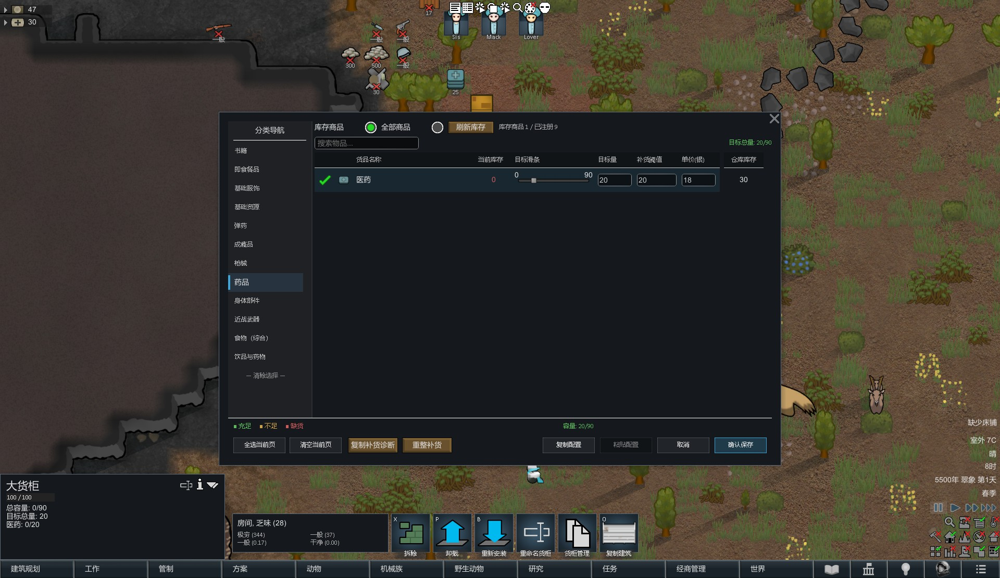
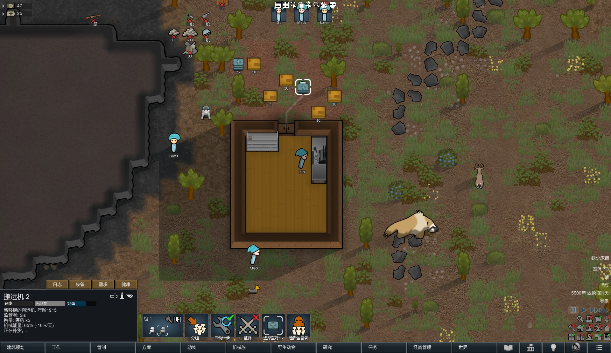

# RSMF Restock Fix

RimWorld 1.6 companion mod for **RimSimManagementFramework** that hardens automatic restock and improves the goods manager inventory workflow.

| | |
|---|---|
| **Author** | yyyyy |
| **packageId** | `yyyyy.rsmf.inventorygoodsfilter` |
| **Game version** | 1.6 |
| **License** | MIT |

## Features

- More reliable auto-restock (threshold checks, reservation tracking, queue self-heal, silent background wake)
- Inventory filter and warehouse stock column in the goods manager
- Optional [Adaptive Storage Framework](https://steamcommunity.com/workshop/filedetails/?id=3033905855) compatibility
- Colony hauling mechs can participate in restock when assigned the shop Restocker role

## Screenshots

### Goods manager



### Mech restock



## Requirements

- [Harmony](https://steamcommunity.com/sharedfiles/filedetails/?id=2009463077)
- RimSimManagementFramework (边缘模拟经营框架)
- Optional: Adaptive Storage Framework

## Install

1. Download this repository (or a release archive)
2. Place the folder under `RimWorld/Mods/`
3. Enable **RSMF Restock Fix** in the mod list

Steam Workshop link will be added after publish.

## Load order

```text
Harmony
RimSimManagementFramework
Adaptive Storage Framework   (optional)
RSMF Restock Fix
```

## Build from source

Requirements: .NET SDK with .NET Framework 4.8.1 targeting pack, RimWorld 1.6, Harmony, and RSMF assemblies.

1. Copy `Directory.Build.props.example` to `Directory.Build.props`
2. Point `RimWorldDir`, `HarmonyDll`, and `SimManagementLibDll` at your local installs
3. Build:

```powershell
dotnet build "Source/RSMFInventoryGoodsFilter/RSMFInventoryGoodsFilter.csproj" -c Release
```

Output assembly: `Assemblies/RSMFInventoryGoodsFilter.dll`

## Compatibility

- Safe to add mid-save
- Designed as a non-invasive Harmony companion; falls back when RSMF members are missing
- Does not replace RSMF; load after the framework

## Changelog

### 1.0.0

- Initial public release
- Restock reliability fixes and goods-manager inventory filter
- Optional ASF support and hauling-mech restock participation
